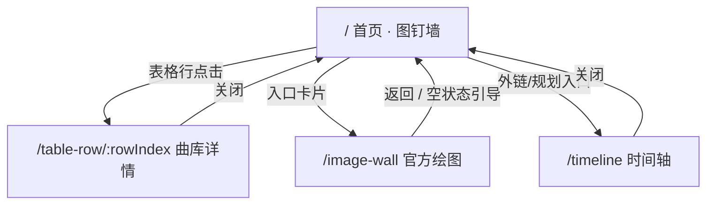

# 产品交互设计方案

## ASU Pinwall

| 属性 | 内容 |
|------|------|
| 文档版本 | V1.0 |
| 更新日期 | 2026-05-09 |
| 依据 | 当前前端实现倒推 + 常见 IxD 文档结构 |
| 关联文档 | `PRD-ASU-Pinwall.md`、`需求说明文档-ASU-Pinwall.md`、`README.zh-CN.md` |

---

## 1. 设计目标与原则

### 1.1 目标

- **空间感**：用画布平移代替传统长滚动首页，强化「策展桌」心智。  
- **可恢复**：二级页一律提供明确「离开」路径，回到首页或返回上一页。  
- **低干扰**：装饰性动效（如鼠标轨迹）不抢夺内容操作。  

### 1.2 原则

- **命中目标分离**：画布拖拽与卡片内滚动/点击区分（如表格行点击、轮播点选）。  
- **一致的热区**：导航、关闭、预览按钮使用同一套方形/尖角视觉语言（见设计系统）。  
- **状态可见**：加载中、空状态、图片未就绪均需有界面反馈。  

---

## 2. 信息架构（IA）

**说明**：首页为**核心枢纽**；其它为**任务型页面**，浅层级、可快速退出。

---

## 3. 用户旅程（摘要）

| 旅程 | 触点 | 用户动作 | 系统反馈 |
|------|------|----------|----------|
| 初访 | 首页 | 拖动画布 | 内容平移、视口框在小地图移动 |
| 查歌 | 表格卡片 | 点某行 | 路由至详情，NProgress 顶部进度 |
| 听/看 | 详情页 | 滚读、点 iframe 区域 | 浏览器原生视频控件 |
| 看图 | 预告卡 → 瀑布流 | 点图 | 打开模态预览，可下载 |
| 时间线 | 进入 /timeline | 搜索、点结果 | TimelineJS 定位（若已就绪） |

---

## 4. 页面级交互说明

### 4.1 首页 · 图钉墙（`PinWall`）

| 元素 | 交互 | 反馈 / 规则 |
|------|------|-------------|
| 画布空白区 | 按下拖拽 | `pin-viewport--dragging` 等态，光标暗示拖动 |
| 画布 | 滚轮 | 双轴平移，`preventDefault` 避免整页滚动 |
| 顶部「导航」 | 点击 | 打开抽屉；Backdrop 点击关闭 |
| 抽屉内列表项 | 点击 | 关闭抽屉并驱动画布导航至对应卡片 |
| 小地图 | 点击 | 以点击点为中心或等价规则移动；带短暂过渡动画 |
| 小地图 | 四象限 / 前进后退 | 跳转到预定义象限中心 |
| 加载遮罩 | — | `aria-busy`；完成后显示小地图 |

### 4.2 曲库表格（`TableContent`）

| 元素 | 交互 | 规则 |
|------|------|------|
| 表体行 | 单击 | 若配置 `rowDetailRouteName` → 整行跳转详情；行样式提示可点击 |
| 外链单元格 | 单击链 | `stop` 冒泡，仅打开外链，不触发行路由 |
| 表体区域 | 滚轮 | `wheel.stop` 防止穿透到画布 |

### 4.3 曲库行详情（`TableRowDetailView`）

| 元素 | 交互 | 规则 |
|------|------|------|
| 关闭「×」 | 点击 | `router.push` 回 `Home` |
| 长内容 | 内部滚动 | 独立滚动容器；不与画布冲突 |

### 4.4 官方绘图（`ImageWallView`）

| 元素 | 交互 | 规则 |
|------|------|------|
| 回到上一逻辑 | 关闭按钮 | `goBack` 或兜底回首页（以实现为准） |
| 瀑布流缩略图 | 点击 / Enter / Space | 打开全屏预览层 `role="dialog"`、`aria-modal` |
| 预览背景 | 点击 | 关闭预览 |
| 预览工具栏 | 下载 / 关闭 | 下载过程禁用按钮防重复 |
| 无图 | — | 提示从图钉墙卡片进入 |

### 4.5 时间轴（`TimelineView`）

| 元素 | 交互 | 规则 |
|------|------|------|
| 关闭 | 点击 | 回首页 |
| 搜索 | 输入 | 过滤列表；选条触发 `goTo` |
| URL `?go=` | 进入页面 | 时间轴 ready 后跳转到指定索引 |

### 4.6 推文轮播（`TweetsCarouselContent`）

| 元素 | 交互 | 规则 |
|------|------|------|
| 点点 | 切换 | `aria-current` 指示当前 |
| 「在 X 上查看」 | 点击 | 新窗口打开 |
| 正文 | HTML | 纵向阅读；区域 `wheel.stop` |

---

## 5. 导航与转场

- **路由切换**：统一经 Vue Router，`NProgress` 呈现线性进度（无 spinner）。  
- **Keep-Alive**：首页 `HomeView` 保持缓存，从二级页返回时尽量保留画布状态（以 `App.vue` `include` 为准）。  

---

## 6. 状态与错误

| 场景 | 表现 |
|------|------|
| 卡片图片未加载完 | 全屏加载层，完成后测宽高再出小地图 |
| 曲库行无效 | 「未找到曲目…」 |
| 图片墙无 session 数据 | 「暂无图片…」 |
| TimelineJS 脚本超时 | 错误处理逻辑（以代码为准）；避免静默失败 |
| 封面图裂图 | 占位块 + `error` 切换 |

---

## 7. 无障碍（A11y）要点

- 预览层、抽屉：`aria-modal`、`aria-label`。  
- 关闭控件：`aria-label` 描述动作（关闭并返回首页等）。  
- 可聚焦控件：图片项 `tabindex="0"`，支持键盘触发（以实现为准）。  

---

## 8. 视觉与动效约束（交互侧）

- **时长**：画布导航过渡约 0.5s 量级 easing（以 `PinWall` 为准）。  
- **触控目标**：顶栏按钮、关闭叉、抽屉项符合最小点击区域。  
- **对比度**：正文与链接在 `Warm Ivory` 背景上保持可读（细见设计系统）。  

---

## 9. 未决与后续优化

- 移动端专门手势（双指缩放画布等）：当前以桌面为主。  
- 时间轴与首页的入口关系：可在画布增加显式卡片或 header 链接。  
- 焦点管理：模态打开时焦点陷阱可加强。  

---

*本方案与实现同步倒推；交互变更请以组件为单一事实来源并回写本节。*
